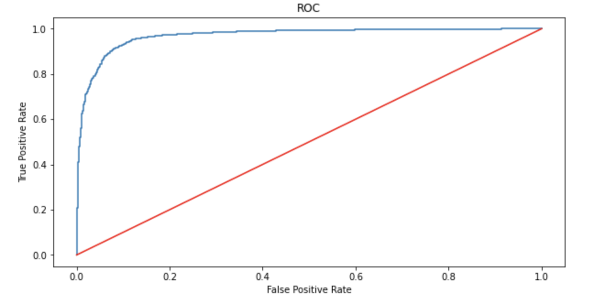

<p align="center">
  
</p>

## The Customer Is Always Right! A Spoonful of Ice Cream Reviews and NLP

### Project Summary
According to the [International Dairy Foods Association](https://www.idfa.org/ice-cream-sales-trends), Americans consume pounds of ice cream per year. That is a whole lot of ice cream! It makes sense for ice cream manufacturers to care a lot about their cusomter's opinions about their flavors. This project seeks out to lend a helping hand to the ice cream industry by building a ice cream review classifier. Using NLP techniques, each review can be classified as good or bad.

In addition to applying machine learning methods to create the classifier, an exensive EDA was done to perform a sentiment analysis, understand which flavors people like/dislike and which brands are most popular.

### Data
The dataset used for this project comes from [Kaggle](https://www.kaggle.com/tysonpo/ice-cream-dataset). The data is broken down into two main dataframes `reviews` and `products`.  These datasets include information for four popular ice cream brands: Haagen Daz, Ben & Jerry's, Breyer's and Taletni. The `reviews` dataframe contains all the information about the review for a specific ice cream flavor. This includes features such as `brand`, `author`, `title`, `text` (which is the content of the review and `stars` (the rating of the flavor on a scale from 1 to 5). The `products` dataframe contains more detailed information about each ice cream flavor. This includes features such as `brand`, `name`, `rating` (the average of all ratings for that flavor) and `rating_count` (the number of times the flavor has been reviewed).

A snippet of both dataframes can be seen below:

`reviews` dataframe: 

```
| brand | key  |     author     |    date    | stars |         title        |  helpful_yes | helpful_no |            text                      |  taste |   ingredients |   texture |   likes |
|:------|:-----|:---------------|:-----------|------:|:---------------------|-------------:|-----------:|:-------------------------------------|-------:|--------------:|----------:|--------:|
|   bj  | 0_bj | Ilovebennjerry | 2017-04-15 |   3   | Not enough browni... |      10      |      3     | Super good, don't get me wrong...    |   nan  |      nan      |    nan    |   nan   |
|   bj  | 0_bj | Sweettooth909  | 2020-01-05 |   5   | I’m OBSESSED wit...  |      3       |      0     | I decided to try it out althoug...   |   nan  |      nan      |    nan    |   nan   |
|   bj  | 0_bj | LaTanga71      | 2018-04-26 |   3   | My favorite...Mo...  |      5       |      2     | My caramel core begins to disap...   |   nan  |      nan      |    nan    |   nan   |
```


`products` dataframe: 

```
| brand |  key |        name         |         subhead          |         description           | rating | rating_count |     ingredients     |
|:------|:-----|:--------------------|:-------------------------|:------------------------------|-------:|-------------:|:--------------------|
|  bj   | 0_bj | Salted Caramel Core | Sweet Cream Ice Cream... | Find your way to the ultima...|  3.7   |      208     | CREAM, SKIM MILK... |
|  bj   | 1_bj | Netflix & Chilll'd™ | Peanut Butter Ice Cre... | There’s something for ever... |  4     |      127     | CREAM, SKIM MILK... |
|  bj   | 2_bj |    Chip Happens     | A Cold Mess of Chocol... | Sometimes “chip” happens a... |  4.7   |      130     | CREAM, LIQUID SU... |
```

Using these two sets of data, a single dataframe was created called `data`. This takes the `brand`, `author`, `title`, `stars` and `text` feautres from `reviews` and the `rating` and `name`, `rating_count` from `products`. A snippet of the `data` dataframe can be seen below:
```
| author         | brand   | name                |   rating |   rating_count |   stars |       title         |                   text             |
|:---------------|:--------|:--------------------|---------:|---------------:|--------:|:--------------------|:-----------------------------------|
| Ilovebennjerry |    bj   | Salted Caramel Core |      3.7 |            208 |       3 | Not enough brown... | Super good, don't get me wrong...  |
| Sweettooth909  |    bj   | Salted Caramel Core |      3.7 |            208 |       5 | I’m OBSESSED wit... | I decided to try it out althoug... |
| LaTanga71      |    bj   | Salted Caramel Core |      3.7 |            208 |       3 | My favorite...Mo... | My caramel core begins to disap... |
```

### Project Breakdown
The main files for this project can be found under `notebooks`:

- [`1_data_wrangling.ipynb`](https://github.com/isabelanyc/Ice-Cream-Reviews/blob/main/notebooks/1_data_wrangling.ipynb):
    - Merged `reviews` and `products` to create the `data` dataframe
    - Created feature `good_review` that takes the value *Good* if `stars` has a value greater than 3 and takes the value *Bad* otherwise. This feature is what allows the problem to become a binary classification problem.
    - Remove stopwords, applied tokenizer, lemmatization, removed special characters and made all words lowercase.
   
- [`2_eda.ipynb`](https://github.com/isabelanyc/Ice-Cream-Reviews/blob/main/notebooks/2_eda.ipynb):
   - Identified which brand is most popular
   - Found which flavors were more/least popular from each brand
   - Performed sentiment analysis
   - Created word clouds for good and bad reviews

- [`3_preprocessing.ipynb`](https://github.com/isabelanyc/Ice-Cream-Reviews/blob/main/notebooks/3_preprocessing.ipynb):
    - Applied TF-IDF vectorizer to transform the text data
    - Shuffled and split the data into testing and training sets

- [`4_modelling.ipynb`](https://github.com/isabelanyc/Ice-Cream-Reviews/blob/main/notebooks/4_modelling.ipynb):
    - Tested four models and one dummy baseline model:
        - Multinomial Naive Bayes
        - Passive Aggressive Classifier
        - Logistic Regression
        - SVM
     - Each model was hyperparameter tuned using a randomized search and a 10 fold cross validation.

### Results
All the models performed fairly well. Each model scored above 0.85 weighted average F1. However, logisitc regression performed the best and ran quite quickly. Below is a snippet of the evaluation metrics and ROC curve:

```
                precision    recall  f1-score   support

         Bad       0.90      0.75      0.82      1349
        Good       0.94      0.98      0.96      5154

    accuracy                           0.93      6503
   macro avg       0.92      0.87      0.89      6503
weighted avg       0.93      0.93      0.93      6503
```

<p align="center">
  
</p>

### Future Work
In the future, I wish to return to this project and make additions and adjustments:
- Use Word2Vec instead of TF-IDF
- Create a pipeine for the entire process
