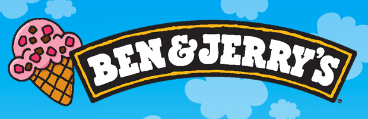

<p align="center">
  
</p>

## The Customer Is Always Right! A Spoonful of Ice Cream Reviews and NLP

### Project Summary
According to the [International Dairy Foods Association](https://www.idfa.org/ice-cream-sales-trends), Americans consume pounds of ice cream per year. That is a whole lot of ice cream! It makes sense for ice cream manufacturers to care a lot about their cusomter's opinions about their flavors. This project seeks out to lend a helping hand to the ice cream industry by building a ice cream review classifier. Using NLP techniques, each review can be classified as good or bad.

In addition to applying machine learning methods to create the classifier, an exensive EDA was done to further understand which flavors people like/dislike and which brands are most popular.

### Data
The dataset used for this project comes from [Kaggle](https://www.kaggle.com/tysonpo/ice-cream-dataset). The data is broken down into 

```
"| brand | key   | author | date  | stars | title |  helpful_yes | helpful_no | text |  taste |   ingredients |   texture |   likes |
|:------|:------|:---------------|:-----------|--------:|:----------------------------------|--------------:|-------------:|:--------------------------------------------------------------------------------------------------------------------------------------------------------------------------------------------------------------------------------------------------------------------------------------------------------------------------------------------------------------------------------------------------------------------------------------------------------------------------------------------------------------------------------------------------------------------------------------------------------------------------------------------------------------------------------------------------------------------------------------------|--------:|--------------:|----------:|--------:|
| bj   | 0_bj  | Ilovebennjerry | 2017-04-15 | 3 | Not enough brownies! | 10 | 3 | Super good, don't get me wrong... | nan | nan | nan | nan |         |       |                |            |         |                                   |               |              | Overall, good flavor...|         |               |           |         
| bj   | 0_bj  | Sweettooth909  | 2020-01-05 | 5 | I’m OBSESSED wit... |  3 | 0 | I decided to try it out althoug... | nan | nan | nan | nan |
| bj   | 0_bj  | LaTanga71      | 2018-04-26 |       3 | My favorite...More Caramel|             5 |            2 | My caramel core begins to disappear about half way through. I only buy this for the caramel core. The first time I purchased this I was not even aware that there were blonde bits in there. You had me a salted caramel core, well this is the fourth pint that I have purchased and the caramel is plentiful at the top then it begins to get sparse about half way down at 3/4s of the way down its gone. It works out in my husbands favor because he doesn't care for the caramel so he gets to finish my pint while having a full pint of his choice. Please please please, its called salted caramel core for a reason. Let the caramel flow through the core. P.S. You could put a little extra in there, I totally would not mind. |     nan |           nan |       nan |     nan |"
```


### Project Breakdown
The main files for this project can be found under `notebooks`:

- `1_data_wrangling.ipynb`: 
   
- `2_eda.ipynb`:

- `3_preprocessing.ipynb`:

- `4_modelling.ipynb`:

### Results

```
                precision    recall  f1-score   support

         Bad       0.90      0.75      0.82      1349
        Good       0.94      0.98      0.96      5154

    accuracy                           0.93      6503
   macro avg       0.92      0.87      0.89      6503
weighted avg       0.93      0.93      0.93      6503
```

### Future Work
